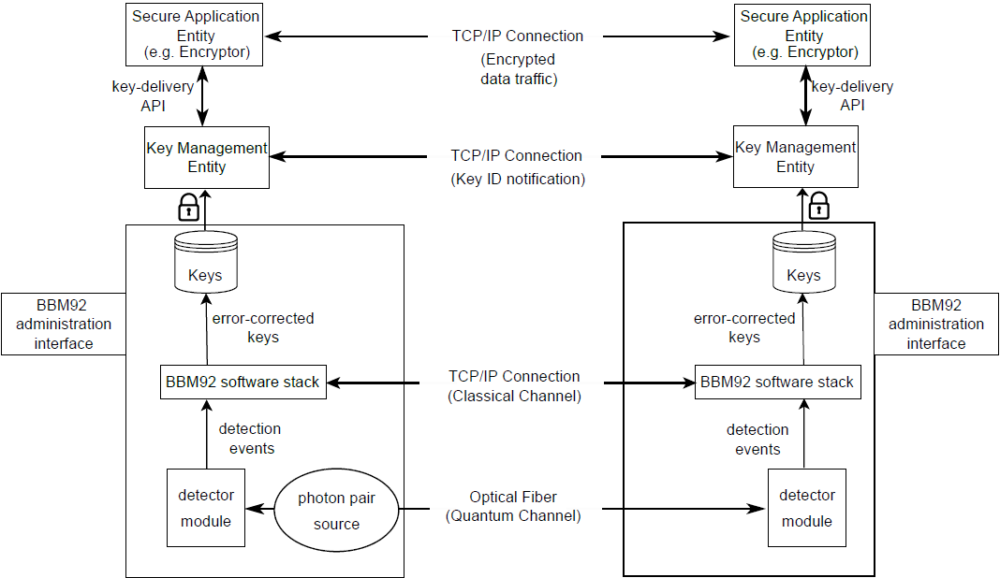

========
Theory
========

This section documents the theory behind the qcrypto functions and the options that are used in the actual `QKDServer <https://github.com/s-fifteen-instruments/QKDServer>`_ implementation. QKDServer is a seperate S-Fifteen QKD software suite that calls on qcrypto as part of its backend.

.. _section-qcrypto-in-action:

-------------------------------------
qcrypto in action
-------------------------------------
This section covers how qcrypto functions are used in QKDServer. Qcrypto and QKDServer are software suites used in S-Fifteen's implementation of the BBM92 QKD protocol for secure communication with entangled photons.

.. _subsection-general-flow:

^^^^^^^^^^^^^
General Flow
^^^^^^^^^^^^^

The protocol begins with two parties, conventionally refered to as Alice and Bob. A photon source generates entangled photon pairs and sends half of every pair to Alice and the other half to Bob. In reality, the source may be co-located with either party, typically Alice.

Upon receiving their half of the photon pair, they will need to record the timing of the photon arrival for later comparison with the other party. This is done by the program :code:`readevents.c`. 

Since each photon of a photon pair travels different paths (one to Alice and another to Bob), they experience different levels of attenuation, dispersion, polarization drift etc. Consequently, Alice and Bob will see different photon count rates despite using the same source. If the photon source is co-located with Alice, she will likely see higher count rates as the photons travel a shorter distance to reach her. Thus, Alice may be referred to as 'high-count side' and Bob 'low-count side'.

After the photon arrival times are registered by :code:`readevents.c`, the timestamps are sorted or chopped into appropriate time bins by :code:`chopper.c` and :code:`chopper2.c`. :code:`chopper2.c` operates on the high-count side and :code:`chopper.c` on the low-count side.

After chopping, :code:`pfind.c` is used by both parties to find the appropriate coincidence window.

Finally :code:`costream.c` is used by both parties to track the coincidences that fall within the coincidence window and accidentals that fall outside the coincidence window.

.. _subsection-specific-options:

^^^^^^^^^^^^^^^^^^
Specific Options
^^^^^^^^^^^^^^^^^^

This section covers the specific options that QKDServer uses with qcrypto. For a general overview, see the subsection `subsection-general-flow`_. The goal of this section is to highlight options that will enhance understanding of the QKDServer backend. Hence, certain options that are more technical in nature may not be listed here. For a full list of options used in QKDServer, refer to `source code <https://github.com/s-fifteen-instruments/QKDServer/tree/master/S15qkd>`_.

:code:`readevents.c` is registers the arrival timestamps of detected photons. It is called by QKDServer with the following options in :code:`readevents.py` `[source] <https://github.com/s-fifteen-instruments/QKDServer/blob/master/S15qkd/readevents.py#L22-L29>`_:

====== ==================================== ===========
Option Argument                             Description
====== ==================================== ===========
-A       None                               Absolute time. Adds unix time to the current timestamp.
-D       d1,d2,d3,d4                        Detector skews in units of 1/256 nsec.
-X       None                               Due to legacy reasons, swap word order in 64-bit timestamp.
-b       Blind_mode, levela, levelb         Set options for self-blinding operation           
-a       1                                  Output mode of timestamps. Argument 1 returns timestamps as 64-bit                                               entities.
====== ==================================== ===========

Combining the options above, here is an example command that may be issued to the timestamp card:

.. code-block:: console

   readevents7 -A -D -8,33,36,0 -X -b 225,900,0 -a1
   
:code:`chopper2.c` is responsible for sorting the timestamps on the high-count side into suitably sized bins. It is called by QKDServer with the following options in :code:`chopper2.py` `[source] <https://github.com/s-fifteen-instruments/QKDServer/blob/master/S15qkd/chopper2.py#L58-L67>`_:

====== ==================================== ===========
Option Argument                             Description
====== ==================================== ===========
-m       20000                               Maximum time (in microseconds) for a consecutive event to be                                                   meaningful. 
-U       None                               Timestamps use Unix time as origin.
====== ==================================== ===========

:code:`chopper.c` is responsible for sorting the timestamps on the low-count side into suitably sized bins. It is called with the following options in :code:`chopper.py` `[source] <https://github.com/s-fifteen-instruments/QKDServer/blob/master/S15qkd/chopper.py#L61-L73>`_

====== ==================================== ===========
Option Argument                             Description
====== ==================================== ===========
-Q       5                                  Filter time constant for bitlength optimizer (?)
-U       None                               Timestamps use Unix time as origin.
-p       1                                  Specifies operation mode. 1 - Normal BBM92 operation. 0 - Service mode. 64-bit timestamps are explicitly shared between Alice and Bob. NOT SECURE for normal QKD operation.
====== ==================================== ===========

:code:`pfind.c` is responsible for finding an appropriate time window so that two timestamps (one each from Alice and Bob) that fall within this window are counted as coincidences and those that fall without are counted as accidentals. It is called with the following options in :code:`pfind.py` `[source] <https://github.com/s-fifteen-instruments/QKDServer/blob/master/S15qkd/pfind.py#L11-L20>`_.

====== ==================================== ===========
Option Argument                             Description
====== ==================================== ===========
-r       2                                  Resolution of timing info in nanoseconds. Will be rounded to closest power of 1 nsec.
-R       128                                resolution of coarse timing info in nanoseconds. Will be rounded to closest power of 1 nsec.
-q       25                                 Order of FFT buffer size. Defines the wraparound size of the fine/coarse periode finding part. Must lie within 12 to 23. (?)
====== ==================================== ===========

:code:`costream.c` is responsible for tracking the coincidence window and classifying counts into coincidences or accidentals. It is called with the following options in :code:`costream.py` `[source] <https://github.com/s-fifteen-instruments/QKDServer/blob/master/S15qkd/costream.py#L70-L91>`_

====== ==================================== ===========
Option Argument                             Description
====== ==================================== ===========
-t       time_difference                     Defines the time difference between the two local reference clocks in multiples of 125 ps. Time difference obtained from :code:`pfind.c`. (?)
====== ==================================== ===========
